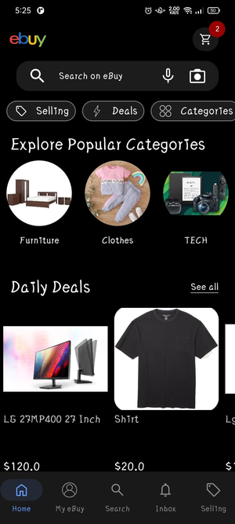
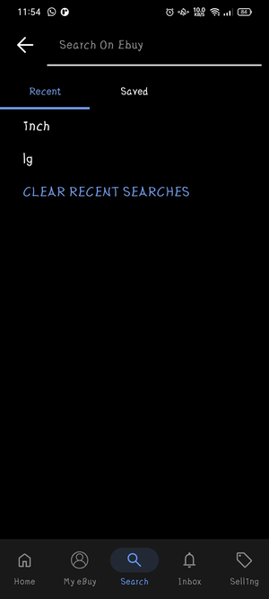
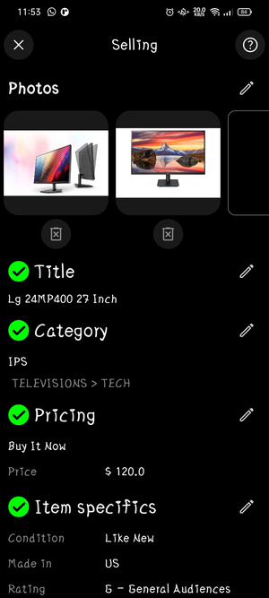
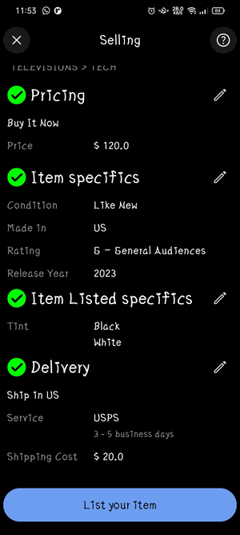
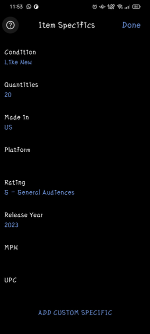
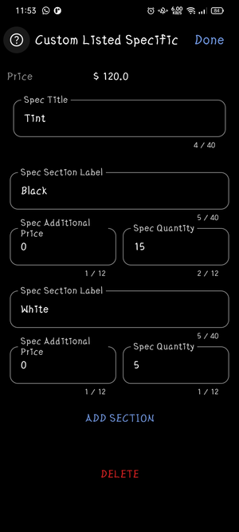
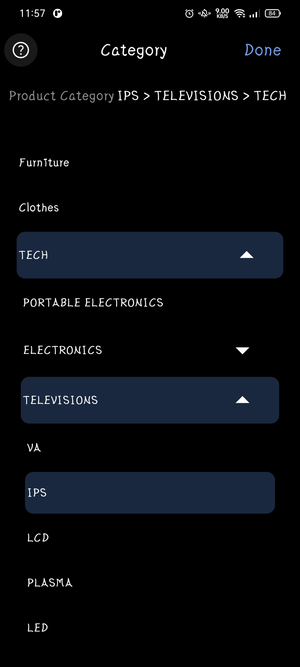
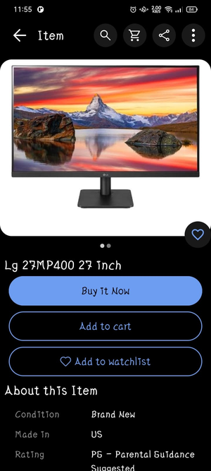
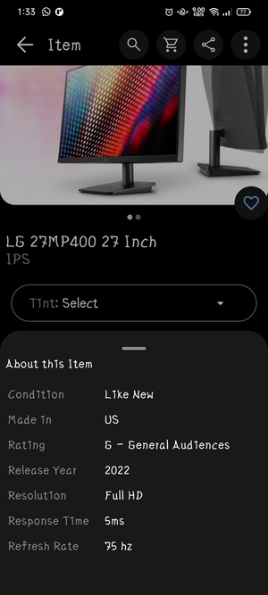

# eBuy Demo "Clone App"

E-commerce application built using Kotlin Multiplatform Mobile (KMM) and Supabase. It leverages Supabase's authentication, real-time capabilities, database, and storage to provide a seamless shopping experience.

# Agile Scrum
## Epic 1: User Management
### Story 1.1: User Registration
- Task ~~1.1.1~~: Implement user registration page design
  - [Registration](https://github.com/OmAr-Kader/eBuy/tree/master/shared/src/commonMain/kotlin/com/ramo/ebuy/ui/sign/LogInScreen.kt)
- Task ~~1.1.2~~: Implement registration validation
  - [Registration](https://github.com/OmAr-Kader/eBuy/tree/master/shared/src/commonMain/kotlin/com/ramo/ebuy/ui/sign/LogInScreen.kt#L249)
- Task ~~1.1.3~~: Create database schema for users
  - [User](https://github.com/OmAr-Kader/eBuy/blob/master/shared/src/commonMain/kotlin/com/ramo/ebuy/data/model/User.kt)
- Task ~~1.1.4~~: Implement user registration functionality
  - [Registration](https://github.com/OmAr-Kader/eBuy/tree/master/shared/src/commonMain/kotlin/com/ramo/ebuy/ui/sign/LogInViewModel.kt#L68)
### Story 1.2: User Login
- Task ~~1.2.1~~: Implement user login page design
  - [Login](https://github.com/OmAr-Kader/eBuy/tree/master/shared/src/commonMain/kotlin/com/ramo/ebuy/ui/sign/LogInScreen.kt)
- Task ~~1.2.2~~: Implement registration validation
  - [Login](https://github.com/OmAr-Kader/eBuy/tree/master/shared/src/commonMain/kotlin/com/ramo/ebuy/ui/sign/LogInScreen.kt#L249)
- Task ~~1.2.3~~: Implement user login functionality
  - [Login](https://github.com/OmAr-Kader/eBuy/tree/master/shared/src/commonMain/kotlin/com/ramo/ebuy/ui/sign/LogInViewModel.kt#L102)
### Story 1.3: User Management Features
- Task 1.3.1: Authentication with end-to-end identity providers

## Epic 2: Product Management
### Story 2.1: Product Listing
- Task ~~2.1.1~~: Implement products listing page Design
  - [HomeUserScreen](https://github.com/OmAr-Kader/eBuy/tree/master/shared/src/commonMain/kotlin/com/ramo/ebuy/ui/user/HomeUserScreen.kt) - [eBuy Common UI Elements](https://github.com/OmAr-Kader/eBuy/tree/master/shared/src/commonMain/kotlin/com/ramo/ebuy/ui/common) - [Common UI Elements](https://github.com/OmAr-Kader/eBuy/tree/master/shared/src/commonMain/kotlin/com/ramo/ebuy/global/ui/Views.kt)
- Task ~~2.1.2~~: Create database schema for products
  - [Product](https://github.com/OmAr-Kader/eBuy/blob/master/shared/src/commonMain/kotlin/com/ramo/ebuy/data/dataSources/product) - [Product Specs](https://github.com/OmAr-Kader/eBuy/blob/master/shared/src/commonMain/kotlin/com/ramo/ebuy/data/dataSources/productSpecs) - [Delivery Process](https://github.com/OmAr-Kader/eBuy/blob/master/shared/src/commonMain/kotlin/com/ramo/ebuy/data/dataSources/delivery)
- Task ~~2.1.3~~: Implement product listing functionality
  - [Product](https://github.com/OmAr-Kader/eBuy/blob/master/shared/src/commonMain/kotlin/com/ramo/ebuy/data/dataSources/product) - [Product Specs](https://github.com/OmAr-Kader/eBuy/blob/master/shared/src/commonMain/kotlin/com/ramo/ebuy/data/dataSources/productSpecs) - [Delivery Process](https://github.com/OmAr-Kader/eBuy/blob/master/shared/src/commonMain/kotlin/com/ramo/ebuy/data/dataSources/delivery)
- Task 2.1.4: Write tests for product listing
### Story 2.2: Product Details
- Task ~~2.2.1~~: Implement product details page design
  - [Product Details Screen](https://github.com/OmAr-Kader/eBuy/blob/master/shared/src/commonMain/kotlin/com/ramo/ebuy/ui/product/ProductDetailsScreen.kt)
- Task ~~2.2.2~~: Implement product details functionality
  - [Product Details Model](https://github.com/OmAr-Kader/eBuy/blob/master/shared/src/commonMain/kotlin/com/ramo/ebuy/ui/product/ProductDetailsViewModel.kt)
- Task 2.2.3: Write tests for product details
### Story 2.3: Product Creating
- Task ~~2.3.1~~: Implement product creating page design
  - [Product Selling Screen](https://github.com/OmAr-Kader/eBuy/blob/master/shared/src/commonMain/kotlin/com/ramo/ebuy/ui/product/ProductSellingScreen.kt) - [Product Selling Sub Screen](https://github.com/OmAr-Kader/eBuy/blob/master/shared/src/commonMain/kotlin/com/ramo/ebuy/ui/product/ProductSellingSubScreens.kt)
- Task ~~2.3.2~~: Implement product creating functionality
  - [Product Selling Model](https://github.com/OmAr-Kader/eBuy/blob/master/shared/src/commonMain/kotlin/com/ramo/ebuy/ui/product/ProductSellingViewModel.kt)
- Task 2.3.3: Write tests for product details

## Epic 3: Admin Panel
### Story 3.1: Category Creating
- Task ~~3.1.1~~: Implement categories creating page Design
  - [Category Creating Screen](https://github.com/OmAr-Kader/eBuy/tree/master/shared/src/commonMain/kotlin/com/ramo/ebuy/ui/admin/CategoryCreatingScreen.kt)
- Task ~~3.1.2~~: Create database schema for categories
  - [Category Model](https://github.com/OmAr-Kader/eBuy/tree/master/shared/src/commonMain/kotlin/com/ramo/ebuy/data/dataSources/category)
- Task ~~3.1.3~~: Implement category creating functionality
  - [Category Creating Model](https://github.com/OmAr-Kader/eBuy/tree/master/shared/src/commonMain/kotlin/com/ramo/ebuy/ui/admin/CategoryCreatingViewModel.kt)
- Task 3.1.4: Write tests for category creating
---

## Epic 4: Shopping Cart
### Story 4.1: Add to Cart
- Task ~~4.1.1~~: Implement “Add to Cart” functionality
  - [Search History](https://github.com/OmAr-Kader/eBuy/tree/master/shared/src/commonMain/kotlin/com/ramo/ebuy/ui/product/ProductDetailsViewModel.kt#L72)
- Task 4.1.2: Write tests for “Add to Cart”
### Story 4.2: View Cart
- Task ~~4.2.1~~: Implement shopping cart page design
  - [Shopping Cart Screen](https://github.com/OmAr-Kader/eBuy/tree/master/shared/src/commonMain/kotlin/com/ramo/ebuy/ui/user/ProfileSubScreen.kt#L84)
- Task ~~4.2.2~~: Implement shopping cart functionality
  - [User Cart Products](https://github.com/OmAr-Kader/eBuy/tree/master/shared/src/commonMain/kotlin/com/ramo/ebuy/ui/user/ProfileSubViewModel.kt#L55)
- Task 4.2.3: Write tests for shopping cart

## Epic 5: UX
### Story 5.1: User Interaction Layer
- Task ~~5.1.1~~: Create database schema for interactions
  - [Interactions](https://github.com/OmAr-Kader/eBuy/tree/master/shared/src/commonMain/kotlin/com/ramo/ebuy/data/dataSources/interaction)
- Task ~~5.1.2~~: Implement user interactions functionality
  - [Search History](https://github.com/OmAr-Kader/eBuy/tree/master/shared/src/commonMain/kotlin/com/ramo/ebuy/ui/user/UserHomeViewModel.kt#L104) - [User Watchlist](https://github.com/OmAr-Kader/eBuy/tree/master/shared/src/commonMain/kotlin/com/ramo/ebuy/ui/user/ProfileSubViewModel.kt#L18) ---
- Task 5.1.3: Write tests for interaction
### Story 5.2: User Confirmations Layer
- Task 5.2.1: Implement user confirmation screens design
- Task 5.2.2: Implement user confirmation functionality
- Task 5.2.3: Write tests for checkout

## Epic 6: Payment Process
### Story 6.1: Checkout
- Task 6.1.1: Implement checkout page design
- Task 6.1.2: Implement checkout functionality
- Task 6.1.3: Write tests for checkout
### Story 6.2: Payment Access Layer
- Task 6.2.1: Implement Unverified Payment designs
- Task 6.2.2: Implement Payment methods validation
- Task 6.2.3: Write tests for checkout

---
---

## 🔗 Links

## Screenshots
## Screenshots
<table><tr>
  <td>  </td>
  <td>  </td>
</tr>
<tr>
  <td>  </td>
  <td>  </td>
</tr>
<tr>
  <td>  </td>
  <td>  </td>
</tr>
<tr>
  <td>  </td>
  <td>  </td>
</tr>
<tr>
  <td>  </td>
  <td>  </td>
</tr></table>
