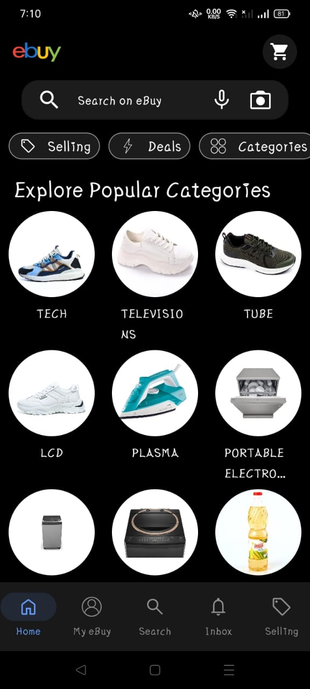

# eBuy Demo "Clone App" (Under Dev)

E-commerce built in Kotlin Multiplatform Mobile using Supabase auth, realtime, database and storage.

# Agile Scrum
## Epic 1: User Management
### Story 1.1: User Registration
- Task ~~1.1.1~~: Implement user registration page design
  - [Registration](https://github.com/OmAr-Kader/eBuy/tree/master/shared/src/commonMain/kotlin/com/ramo/ebuy/ui/sign/LogInScreen.kt)
- Task ~~1.1.2~~: Implement registration validation
- Task ~~1.1.3~~: Create database schema for users
- Task ~~1.1.4~~: Implement user registration functionality
### Story 1.2: User Login
- Task ~~1.2.1~~: Implement user login page design
  - [Login](https://github.com/OmAr-Kader/eBuy/tree/master/shared/src/commonMain/kotlin/com/ramo/ebuy/ui/sign/LogInScreen.kt)
- Task ~~1.2.2~~: Implement registration validation
- Task ~~1.2.3~~: Implement user login functionality
### Story 1.3: User Management Features
- Task 1.3.1: Authentication with end-to-end identity providers

## Epic 2: Product Management
### Story 2.1: Product Listing
- Task ~~2.1.1~~: Implement products listing page Design
  - [HomeUserScreen](https://github.com/OmAr-Kader/eBuy/tree/master/shared/src/commonMain/kotlin/com/ramo/ebuy/ui/user/HomeUserScreen.kt) - [eBuy Common UI Elements](https://github.com/OmAr-Kader/eBuy/tree/master/shared/src/commonMain/kotlin/com/ramo/ebuy/ui/common) - [Common UI Elements](https://github.com/OmAr-Kader/eBuy/tree/master/shared/src/commonMain/kotlin/com/ramo/ebuy/global/ui/Views.kt)
- Task ~~2.1.2~~: Create database schema for products
- Task 2.1.3: Implement product listing functionality
- Task 2.1.4: Write tests for product listing
### Story 2.2: Product Details
- Task ~~2.2.1~~: Implement product details page design
- Task ~~2.2.2~~: Implement product details functionality
- Task 2.2.3: Write tests for product details
### Story 2.3: Product Creating
- Task ~~2.3.1~~: Implement product creating page design
- Task 2.3.2: Implement product creating functionality
- Task 2.3.3: Write tests for product details

## Epic 3: Admin Panel
### Story 3.1: Category Creating
- Task ~~3.1.1~~: Implement categories creating page Design
- Task ~~3.1.2~~: Create database schema for categories
- Task ~~3.1.3~~: Implement category creating functionality
- Task 3.1.4: Write tests for category creating
### Story 3.2: Reference Product Creating
- Task 3.2.1: Implement reference products creating page Design
- Task 3.3.2: Create database schema for reference products
- Task 3.4.3: Implement reference product creating functionality
- Task 3.5.4: Write tests for reference products creating
- 
## Epic 4: Shopping Cart
### Story 4.1: Add to Cart
- Task 4.1.1: Implement “Add to Cart” functionality
- Task 4.1.2: Write tests for “Add to Cart”
### Story 3.2: View Cart
- Task 4.2.1: Implement shopping cart page design
- Task 4.2.2: Implement shopping cart functionality
- Task 4.2.3: Write tests for shopping cart

## Epic 5: Payment Process
### Story 5.1: Checkout
- Task 5.1.1: Implement checkout page design
- Task 5.1.2: Implement checkout functionality
- Task 5.1.3: Write tests for checkout

## Epic 6: Payment Access Layer
### Story 6.1: Check Payment methods Status
- Task 6.1.1: Implement Unverified Payment designs
- Task 6.1.2: Implement Payment methods validation

---
---
---

<!--suppress CheckImageSize -->
## Screenshots

<!--  -->
